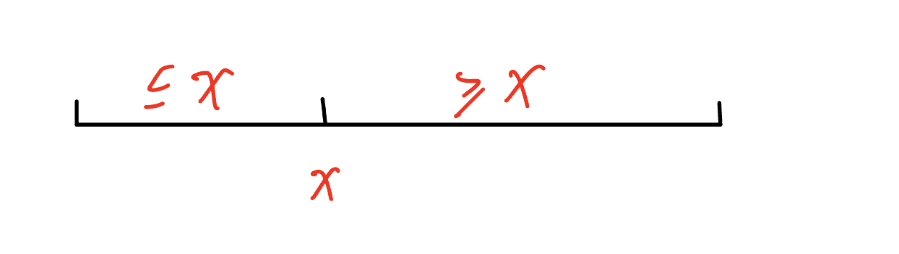
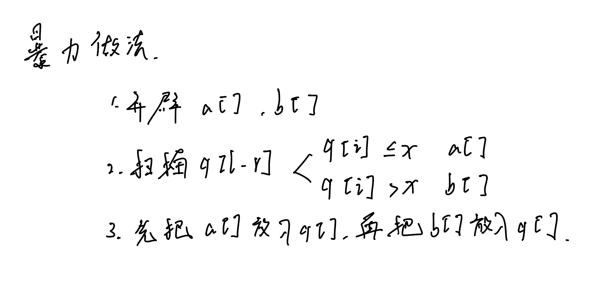
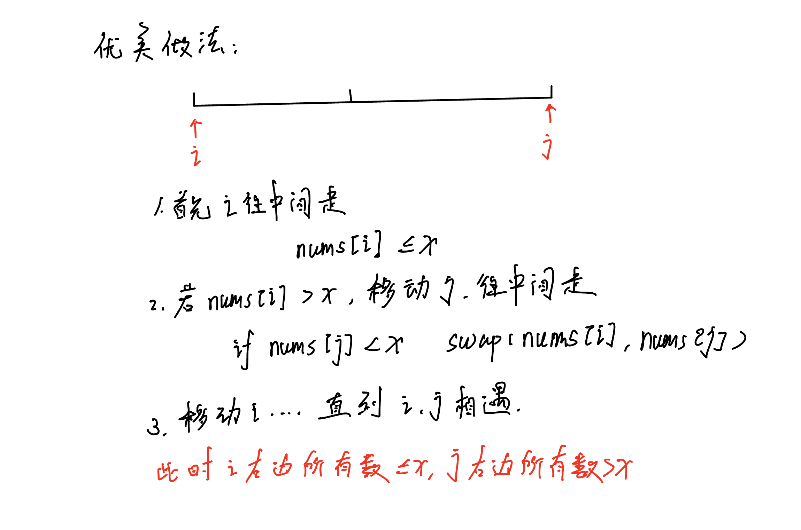
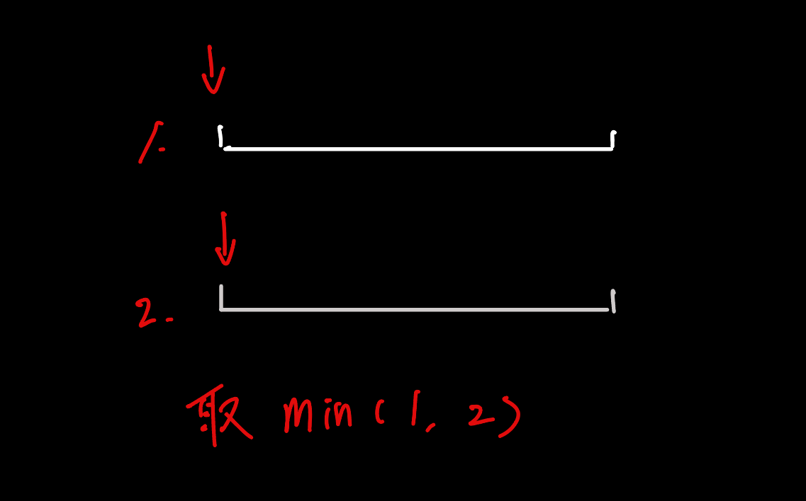

# LeetCode

- ## 排序

  - #### 快排——分治

    1. 确定分界点 q[l] || q[r] || q[(l + r) / 2] || 随机

    2. 调整区间 —— 根据边界点调整区间

       

    3. 递归处理左右两边

       

       

       ```java
       public void quick_Sort(int[] nums, int l, int r){
         if(l >= r) return;
         int mid = nums[(l + r) / 2];
         int i = l - 1;
         int r = r + 1;
         while(i < j){
           while(q[i] < mid) i++;
           while(q[i] > mid) j--;
           if(i < j) swap(nums[i], nums[j]);
         }
         quick_Sort(nums, l, j);
         quick_Sort(nums, j + 1, r);
         }	
       ```

       - ### 归并排序

         1. 确定分界点 mid = (l + r) / 2

         2. 递归排序left、right

         3. 归并——合二为一

            

         ```java
         public void merge_Sort(int[] nums, int l, int r){
           if(l >= r) return;
           int mid = l + (r - l) >> 1;
           merge_Sort(nums, l, mid);
           merge_Sort(nums, mid + 1, r);
           int k = 0, i = l, j = mid + 1;
           while(i <= mid && j <= r){
             if(nums[i] <= nums[j]){
               temp[k++] = nums[i++];
             }else{
               temp[k++] = nums[j++];
             }
           }
           while(i <= mid){
             temp[k++] = nums[i++];
           }
           while(j <= r){
             temp[k++] = nums[j++]
           }
           for(i = 1, j = 0; i <= r; i++, j++){
             nums[i] = temp[j];
           }
         }
         ```

    - ### 二分排序

      **有单调性一定可以二分，但是二分的本质不是单调性**

      1. mid = (l + r) / 2

         
